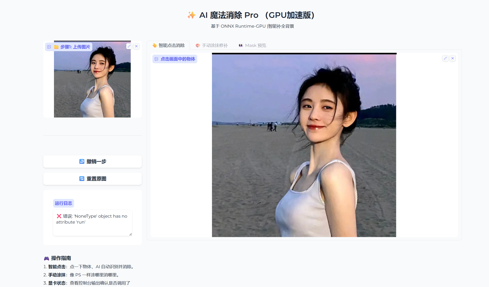
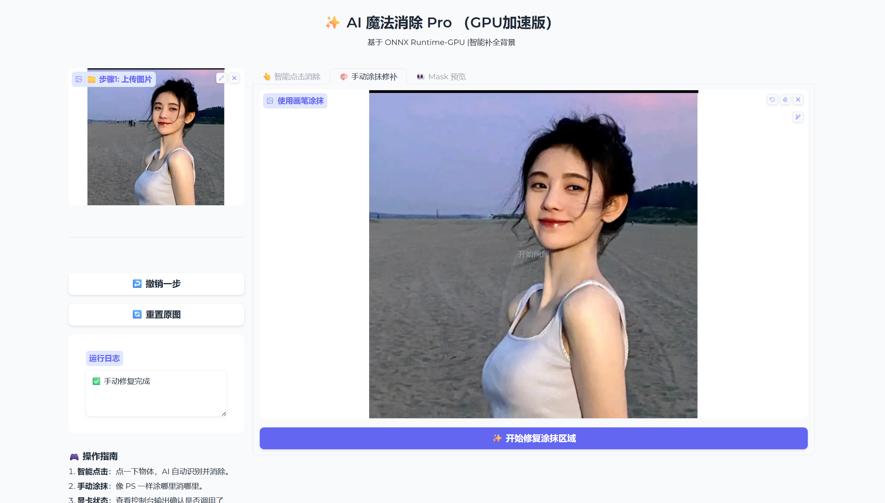

# AI Magic Remover - 基于 MobileSAM + LaMa 的智能物体消除工具

[](https://huggingface.co/spaces/Zayn-ai/AI-Magic-Remover)

基于 **MobileSAM**（轻量级分割模型）和 **LaMa**（图像修复模型）构建的交互式智能物体消除工具。用户只需在图片上点击目标物体，AI 即可自动识别并消除该物体，同时智能填补背景。全流程采用 ONNX Runtime 推理，支持 CPU/GPU 部署，并提供 Gradio Web 界面和 PyInstaller 桌面端打包方案。

## 效果展示

### 消除效果对比

<p align="center">
  
  
</p>
<p align="center"><i>左: 原图 (背景有行人) → 右: AI 消除后 (行人被移除，背景自动填补)</i></p>

### 应用界面

<p align="center">
  
</p>
<p align="center"><i>智能点击模式 - 点击物体即可消除</i></p>

<p align="center">
  
</p>
<p align="center"><i>手动涂抹模式 - 类似 Photoshop 污点修复画笔</i></p>

## 技术架构

```
输入图片                          用户交互
  │                                │
  ▼                                ▼
┌─────────────────┐    ┌──────────────────┐
│  MobileSAM      │    │  点击坐标 / 手动  │
│  Image Encoder  │    │  涂抹 Mask       │
│  (ONNX)         │    └────────┬─────────┘
└────────┬────────┘             │
         │ 图像特征              │ 提示信息
         ▼                      ▼
    ┌─────────────────────────────┐
    │    MobileSAM Mask Decoder   │
    │    (ONNX)                   │
    └──────────────┬──────────────┘
                   │ 分割 Mask
                   ▼
         ┌──────────────────┐
         │  Mask 膨胀处理    │
         │  (OpenCV)        │
         └────────┬─────────┘
                  │
                  ▼
    ┌─────────────────────────────┐
    │    LaMa Inpainting Model    │
    │    (ONNX)                   │
    └──────────────┬──────────────┘
                   │
                   ▼
              修复后的图片
```

## 核心技术点

| 技术 | 说明 |
|------|------|
| **MobileSAM** | Meta SAM 的轻量版，Tiny ViT 架构，Encoder 仅 28MB，适合边缘/桌面部署 |
| **LaMa** | Large Mask Inpainting，基于傅里叶卷积的图像修复模型，擅长处理大面积遮挡 |
| **ONNX Runtime** | 跨平台推理引擎，脱离 PyTorch 依赖，支持 CPU/CUDA/TensorRT 等多后端 |
| **Gradio** | 快速构建 Web UI，支持图片上传、点击交互、画笔涂抹等 |
| **PyInstaller** | 将 Python 应用打包为独立可执行文件，无需安装环境即可运行 |

### 算法流程细节

1. **图像编码**: 输入图片经 MobileSAM Encoder 提取 256 维特征图 (1x256x64x64)
2. **坐标变换**: 用户点击坐标按比例映射到 1024x1024 特征空间
3. **Mask 生成**: Decoder 根据图像特征 + 提示点输出分割 Mask
4. **Mask 膨胀**: 使用 OpenCV 形态学膨胀扩大 Mask 边界，防止消除残留
5. **图像修复**: LaMa 对 Mask 区域进行 512x512 修复，自动检测输出范围 (0-1 或 0-255)
6. **融合输出**: 仅替换 Mask 区域像素，保持非修复区域原始分辨率

## 功能特性

- **智能点击消除**: 点一下物体，AI 自动识别轮廓并消除
- **手动涂抹修补**: 类似 Photoshop 污点修复画笔，涂哪修哪
- **连续消除**: 支持多次点击消除不同物体，操作可撤销/重置
- **Mask 可视化**: 调试模式展示算法识别到的分割区域
- **GPU 加速**: 自动检测 CUDA，有 GPU 则加速推理
- **桌面端打包**: 提供 PyInstaller 配置，可打包为独立 .exe 程序

## 目录结构

```
AI-Magic-Remover/
├── app_pure_onnx.py              # 主应用入口 (纯 ONNX 推理 + Gradio UI)
├── requirements.txt              # Python 依赖
├── .gitignore
│
├── tutorials/                    # 学习过程代码 (Day 1 ~ Day 5 渐进式开发)
│   ├── README.md                 # 教程说明与学习路线
│   ├── day1_run.py               # Day 1: PyTorch 原生推理 MobileSAM
│   ├── day2_export_onnx.py       # Day 2: 导出 Decoder 为 ONNX 格式
│   ├── day3_onnx_inference.py    # Day 3: ONNX Runtime 混合推理
│   ├── day4_magic_remove.py      # Day 4: OpenCV Inpainting 基础消除
│   ├── day4_lama_pro.py          # Day 4: LaMa 深度学习修复 (进阶)
│   └── day5_app.py               # Day 5: Gradio 交互式应用 (PyTorch+ONNX)
│
├── scripts/                      # 工具脚本
│   ├── export_encoder.py         # 导出 MobileSAM Encoder 为 ONNX
│   └── benchmark_speed.py        # PyTorch vs ONNX 推理速度对比测试
│
├── packaging/                    # 桌面端打包配置
│   ├── AI_Magic_Lite_Version.spec    # PyInstaller 精简版打包配置
│   └── AI_Magic_CPU_Mode.spec        # PyInstaller CPU 版打包配置
│
├── deploy/                       # Hugging Face Spaces 在线部署
│   ├── app.py                    # HF Spaces 入口文件
│   ├── requirements.txt          # 部署专用依赖
│   └── README.md                 # 部署指南
│
├── docs/                         # 实训文档 (不纳入 git)
│   ├── AI Magic Eraser Pro 完整版演示.pdf
│   └── AI魔法消除Pro.doc
│
└── assets/                       # 展示素材 (效果图等)
```

## 模型文件

模型文件未包含在 Git 仓库中（体积过大），请自行下载并放置到项目根目录：

| 文件 | 大小 | 说明 | 来源 |
|------|------|------|------|
| `mobile_sam_encoder.onnx` | 28 MB | MobileSAM 图像编码器 | 由 `scripts/export_encoder.py` 从 .pt 导出 |
| `mobile_sam_decoder.onnx` | 16 MB | MobileSAM 掩膜解码器 | 由 `tutorials/day2_export_onnx.py` 导出 |
| `lama_fp32.onnx` | 208 MB | LaMa 图像修复模型 | [LaMa ONNX](https://github.com/Sanster/models/releases) |
| `mobile_sam.pt` | 40 MB | MobileSAM PyTorch 权重 (仅教程需要) | [MobileSAM](https://github.com/ChaoningZhang/MobileSAM) |

## 快速开始

### 环境配置

```bash
# 克隆仓库
git clone https://github.com/zxy2016567076/AI-Magic-Remover.git
cd AI-Magic-Remover

# 安装依赖
pip install -r requirements.txt

# (可选) 如果有 NVIDIA GPU，安装 GPU 版 ONNX Runtime
pip install onnxruntime-gpu
```

### 下载模型

将上表中的 3 个 `.onnx` 模型文件下载后放到项目根目录。

### 运行

```bash
python app_pure_onnx.py
```

启动后浏览器会自动打开 `http://127.0.0.1:7860`，即可使用。

### 打包为桌面应用 (可选)

```bash
# 确保模型文件在当前目录
pip install pyinstaller
pyinstaller packaging/AI_Magic_CPU_Mode.spec
# 生成的可执行文件在 dist/AI_Magic_CPU_Mode/ 目录下
```

## 学习路线

本项目采用渐进式开发，从基础到完整应用分 5 天完成，详见 [tutorials/README.md](tutorials/README.md)：

| 阶段 | 内容 | 核心知识点 |
|------|------|-----------|
| Day 1 | PyTorch 原生推理 | SAM 架构 (Encoder-Decoder)、SamPredictor API |
| Day 2 | ONNX 模型导出 | torch.onnx.export、动态轴、SamOnnxModel Wrapper |
| Day 3 | ONNX Runtime 推理 | 坐标空间变换、Data Marshalling、混合推理 |
| Day 4 | 图像修复算法 | OpenCV Inpainting vs LaMa、Mask 膨胀、输出范围处理 |
| Day 5 | 完整应用集成 | Gradio Blocks、状态管理、多模式交互、GPU 优化 |

## 技术亮点

1. **全 ONNX 推理链**: Encoder + Decoder + LaMa 三个模型全部使用 ONNX Runtime，无需安装 PyTorch 即可运行，显著降低部署门槛
2. **自适应输出处理**: 自动检测 LaMa 模型输出范围 (0-1 / 0-255)，兼容不同版本的导出模型
3. **渐进式架构演进**: 从 PyTorch 混合推理 → 纯 ONNX 推理，展示了模型部署优化的完整思路
4. **桌面端打包**: 通过 PyInstaller 实现一键打包，非技术用户也能直接使用

## License

本项目为课程实训作品，仅供学习参考。
